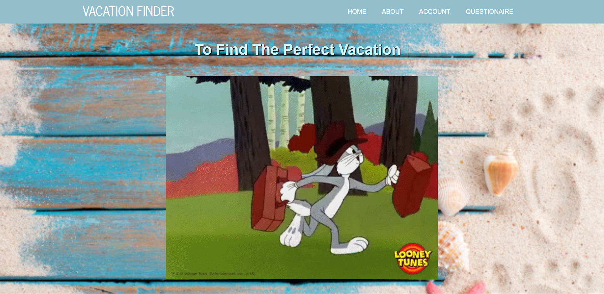

# Vacation Finder

# Description 
As a user, I want to freely explore my options to find the best vacation for me. Using the questionaire page, the user 
is able to pick their interest and the app is going to help the user find different locations that applies to that interest.
From there, the user will have different options to pick and the app will tell them what airports the place has. 

# Table Of Contents

- [Description](#description)

- [Screenshot](#screenshot)

- [Deployment](#deployment)

- [Tech Used](#tech)

# Screenshot 

# Deployment 
https://github.com/jhohing/VacationFinder

https://secure-depths-72910.herokuapp.com/

# Tech Used 
1. React.js
2. Node.js
3. Axios
4. Bootstrap
5. mongoose
